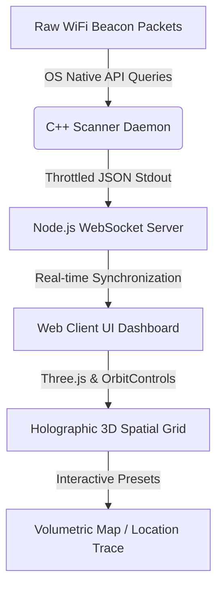

# sudonishant // Spatial Mapper (WiFi Volumetric Radar)

[](https://opensource.org/licenses/MIT)
[](https://isocpp.org/)
[](https://nodejs.org/)
[](#)

An advanced, industry-grade spatial mapper and volumetric radar designed to query low-level Wi-Fi signal metrics in real-time, build volumetric occupancy grids, and render them inside a sleek, Apple-style 3D WebGL dashboard. The codebase provides direct native daemon bindings for C++ hardware scans, combined with an interactive telemetry visualization suite.



---

## Key Features

*   **Apple-Inspired Aesthetic**: High-quality dark-mode UI, minimalist glassmorphism, responsive segmented controls, and layout.
*   **Dual Telemetry Engines**:
    *   **Real Card Mode**: Connects directly to hardware interfaces (`/proc/net/wireless` on Linux, CoreWLAN on macOS, Wlanapi on Windows) for millisecond-level signal tracking.
    *   **Virtual Emu Mode**: Built-in wave-based signal simulator for instant offline mapping.
*   **Volumetric 3D Shader**: High-performance Three.js pipeline translating signal intensity into clear thermal-gradient gradients (Ironbow, Rainbow, White/Black Hot).
*   **Spatial Diagnostics**: CSI Monitor, real-time respiration/movement detection, classified structural counts, and automatic warning thresholds.
*   **Robust disk storage**: Active mapping nodes are persisted locally with a debounced JSON transaction cache to optimize filesystem performance.

---

## Fast Start

We provide an automated setup script that installs dependencies, compiles the C++ scanner, and provisions the server automatically.

```bash
# 1. Clone the repository
git clone https://github.com/sudonishant/wifi-thermal-spatial-mapper.git
cd wifi-thermal-spatial-mapper

# 2. Grant permissions and run setup
chmod +x setup.sh
./setup.sh

# 3. Start the dashboard
npm --prefix web start
```
Open **[http://localhost:8080](http://localhost:8080)** in your browser to view the mapping dashboard.

---

## Technical Stack

| Component | Technology | Description |
| --- | --- | --- |
| **Daemon Engine** | C++17 | Direct low-level OS API calls for zero-latency network scans. |
| **Web Server** | Node.js (Express, ws) | Ultra-lightweight REST API & WebSocket pipeline. |
| **Render Viewport** | WebGL (Three.js) | Volumetric spatial grid rendering and particle animations. |
| **Theme System** | Pure CSS3 (Apple Design) | Minimalist layout, native system fonts, and layout tokens. |

---

## Controls Reference

| Control | Action |
| --- | --- |
| **3D MAPPING** Preset | Switches to Volumetric occupancy mode. |
| **LOCATION TRACE** Preset | Displays historical walking trajectories. |
| `W`, `A`, `S`, `D` | Orbit / Pan Camera in 3D Viewport. |
| `Mouse Drag` | Look Around (Rotate perspective). |
| `Up` / `Down` / `Left` / `Right` | Move the Virtual Walker across the scan grid. |
| `SPACE` | Manually plot a new signal checkpoint. |

---

## License

This project is licensed under the MIT License - see the [LICENSE](LICENSE) file for details. Created by [sudonishant](https://github.com/sudonishant).
