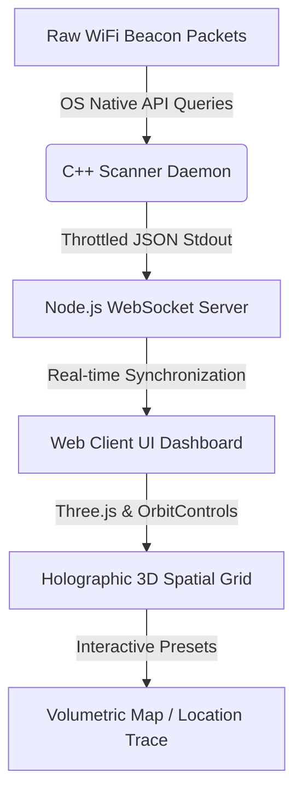

# 📡 AetherSense: WiFi 3D Volumetric Occupancy Radar & Spatial Scanner

[](https://opensource.org/licenses/MIT)
[](https://isocpp.org/)
[](https://nodejs.org/)
[](https://threejs.org/)

An advanced, industry-grade wireless spatial mapping engine and volumetric occupancy radar. **AetherSense** scans real-time Wi-Fi beacon packets and radio frequency (RF) signal metrics, builds high-fidelity 3D occupancy grids, and visualizes RF propagation patterns through a premium, glassmorphic WebGL telemetry dashboard.



---

## 🚀 Key Features

*   **Holographic 3D Volumetric Rendering**: A high-performance WebGL (Three.js) viewport that maps wireless signal strength (RSSI/CSI) to a 3D thermal-gradient grid (featuring Ironbow, Rainbow, and Monochromatic presets).
*   **Zero-Latency Native Daemon**: Low-level C++17 engine interfacing directly with OS network stacks:
    *   **Linux**: Direct `/proc/net/wireless` and sockets polling.
    *   **macOS**: Native CoreWLAN framework bridging.
    *   **Windows**: Native Wlanapi service integration.
*   **Dual Mode Telemetry**:
    *   *Real Card Mode*: Active scanner interfacing with hardware for live physical diagnostics.
    *   *Virtual Emu Mode*: Built-in wave propagation algorithm for simulated offline testing and walk-throughs.
*   **Apple-Inspired TUI/GUI HUD**: High-fidelity dark mode styling, frosted-glass panels, segmented dashboard selectors, and interactive telemetry dials.
*   **Diagnostic Overlays**: Real-time respiration/motion detection proxies, classified path counts, and automated threshold alerts.

---

## 🛠️ Tech Stack

| Module | Core Technology | Role |
| --- | --- | --- |
| **Daemon Engine** | C++17 / CMake | Gathers network signal frames with zero-overhead native loops. |
| **Web Server** | Node.js / Express / ws | Manages low-latency WebSocket connection pipes. |
| **3D Rendering** | Three.js / GLSL Shaders | Visualizes volumetric occupancy grids in a responsive viewport. |
| **Theme & UI** | Vanilla CSS3 / HTML5 | Frosted glassmorphism dashboard controls and statistics. |

---

## 📥 Getting Started

### Prerequisites

Ensure you have a modern compiler supporting **C++17**, **CMake (>= 3.15)**, and **Node.js (>= 18.0.0)** installed.

### Automatic Installation & Execution

A unified shell script compiles the native C++ executable and configures the web application automatically.

```bash
# 1. Clone the repository
git clone https://github.com/sudonishant/aethersense.git
cd aethersense

# 2. Grant execute permissions and run setup
chmod +x setup.sh
./setup.sh

# 3. Spin up the server and visualization dashboard
npm --prefix web start
```

Open **[http://localhost:8080](http://localhost:8080)** in your web browser to access the live dashboard controls.

---

## ⌨️ Telemetry Controls

| Shortcut | Description |
| --- | --- |
| **`W` / `A` / `S` / `D`** | Orbit and Pan the 3D camera around the volumetric mapping grid. |
| **`Up` / `Down` / `Left` / `Right`** | Drive the virtual mapping probe through the spatial grid (Virtual Mode). |
| **`SPACEBAR`** | Log and plot a permanent coordinate signal checkpoint. |
| **`Mouse Drag`** | Rotate perspectives in the WebGL viewport. |
| **`3D MAPPING` UI Toggle** | Switch layout to a volumetric 3D thermal matrix. |
| **`LOCATION TRACE` UI Toggle** | Render real-time spatial path tracking maps. |

---

## 📁 Repository Structure

```text
aethersense/
├── CMakeLists.txt         # C++ build orchestrator
├── LICENSE                # MIT License
├── README.md              # Project documentation
├── include/               # C++ Header declarations
│   ├── WifiScanner.h
│   └── RenderEngine.h
├── src/                   # C++ Core source files
│   ├── main.cpp
│   └── core/
├── setup.sh               # Automation compilation script
└── web/                   # Node.js Server & WebGL Front-end
    ├── server.js          # WebSocket server pipeline
    ├── package.json
    └── public/
        ├── index.html     # Glassmorphic HUD template
        └── app.js         # Three.js viewport loop
```

---

## 📄 License

Distributed under the MIT License. See [LICENSE](LICENSE) for more details. Designed & built by [sudonishant](https://github.com/sudonishant).
